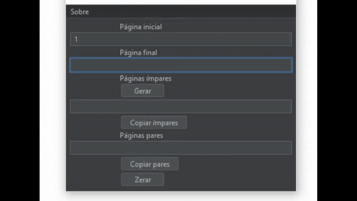
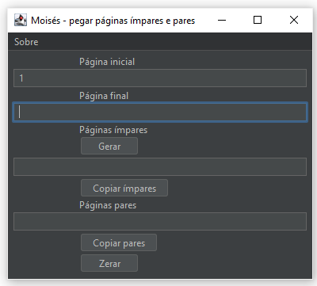

# Paginas-impares-e-pares

## Como usar

O programa é o arquivo Páginas.jar. (se ele não executar, execute o jarfix primeiro, depois funcionará, basta ter o java instalado)

Programa gráfico em Java para pegar as páginas ímpares e as pares dentro de um intervalo, para facilitar a impressão de duas páginas em uma folha

1) Inserir página inicial
2) Inserir página final
3) Clicar em gerar ou apertar Enter
4) Copiar ímpares e depois pares

